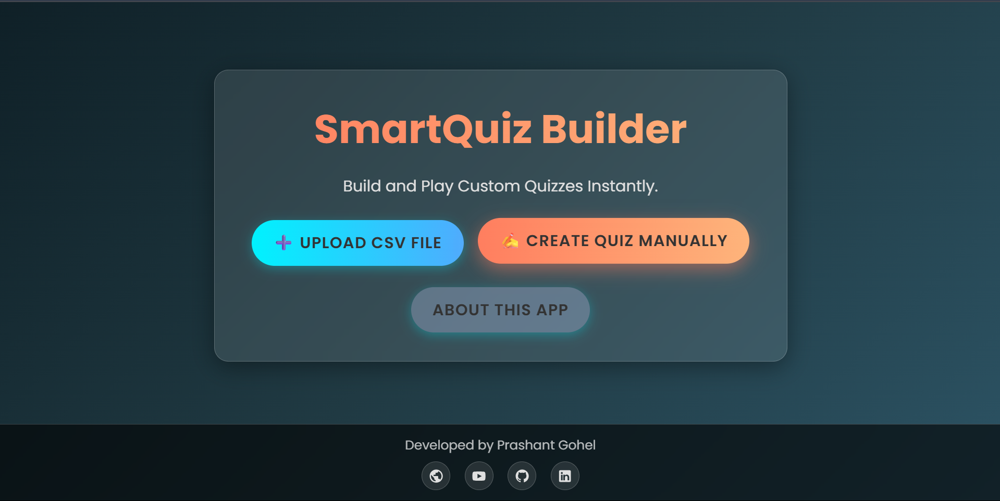
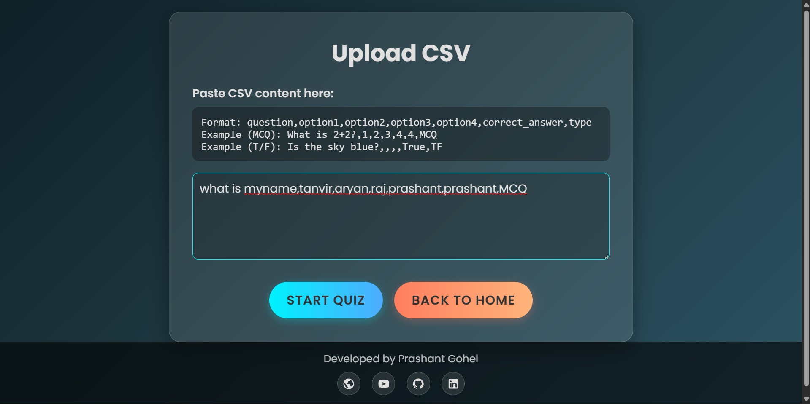
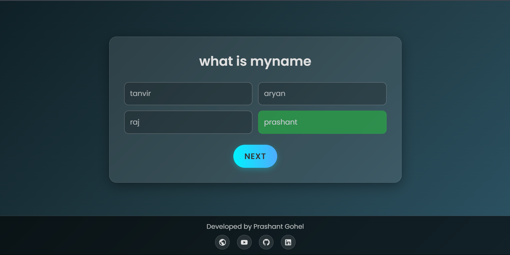
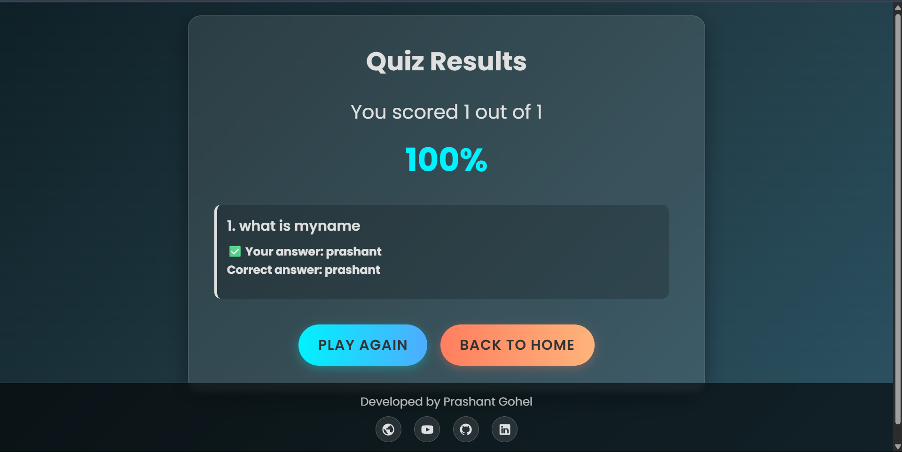

# 🧠 SmartQuiz Builder

**SmartQuiz Builder** is a beautifully designed, fully client-side quiz application that lets users create and take customized quizzes. Users can either **upload a CSV** of questions or **enter them manually** using a clean form. It supports both **Multiple Choice (MCQ)** and **True/False (TF)** questions.

---

## ✨ Features

- Live Demo 👉 [SmartQuiz Builder](https://smart-quiz-builder.netlify.app/)
- 🎨 Eye-catching **Glassmorphism UI**
- 📥 Upload questions using a properly formatted **CSV**
- ✍️ Manually create quiz questions (MCQ / True-False)
- 🔀 Auto-shuffling of quiz questions before starting
- ✅ Real-time scoring and result summary
- 📊 Clear, colorful result screen with correct/incorrect answers
- 📱 Fully responsive design
- 🌙 Future-ready design: supports dark mode styling if extended

---








## 📂 CSV Format

When uploading questions using CSV, make sure the file follows this structure (no headers required):

```csv
question,option1,option2,option3,option4,correct_answer,type
```


### ✅ Example (MCQ):
```csv
What is the capital of France?,Berlin,Madrid,Paris,Rome,Paris,MCQ
```


### ✅ Example (True/False):
```csv
Is the sky blue?,,,,True,TF
```


> Ensure there are no extra spaces or empty lines, and each row ends with the question `type` as either `MCQ` or `TF`.

---

## 🧪 Manual Entry Instructions

- Click on **“Create Quiz Manually”**
- Enter:
  - Question text
  - Select type: MCQ or TF
  - For MCQ, enter at least 2 options
  - Enter the correct answer
- Add more questions using ➕ **Add Question**
- Start the quiz by clicking **Start Quiz**


---

## 📌 Technologies Used

- HTML5
- CSS3 (with custom variables and effects)
- JavaScript (DOM manipulation, state handling)

---

## 📄 Future Enhancements (Ideas)

- ⏱️ Timer for each question
- 🎨 Dark Mode toggle
- 📤 Export results to PDF
- 💾 Save & resume quiz progress using LocalStorage
- 🔗 Shareable quiz links

---

## 🙌 Credits

Developed with ❤️ by **Prashant Gohel**

- 🔗 [YouTube – DevOpsWithUs](https://www.youtube.com/@DevOpsWithUs)
- 🧑‍💻 [GitHub – prashantgohel321](https://github.com/prashantgohel321)
- 👔 [LinkedIn – prashantgohel1706](https://www.linkedin.com/in/prashantgohel1706)

---

## 📜 License

This project is open-source and free to use. You can modify and extend it as per your needs.

---


