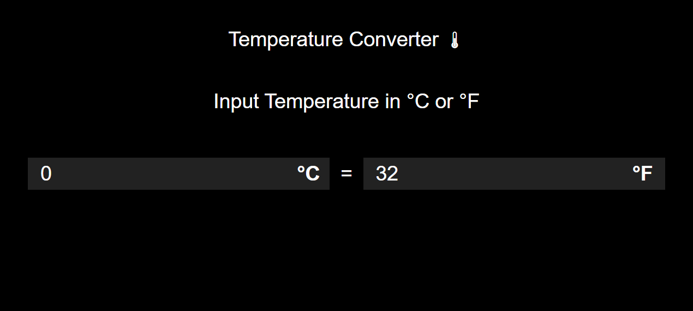

# Temperature Converter🌡
It convert Celsius temperature to Fahrenheit and vice - versa.

# How to use ?
Enter temprature in celsius or Farenheit , it will automatically converts its value.

# Screenshot & Demo link

Link : [Demo](https://iamrahul8.github.io/Temperature-Converter/)

# Built With

